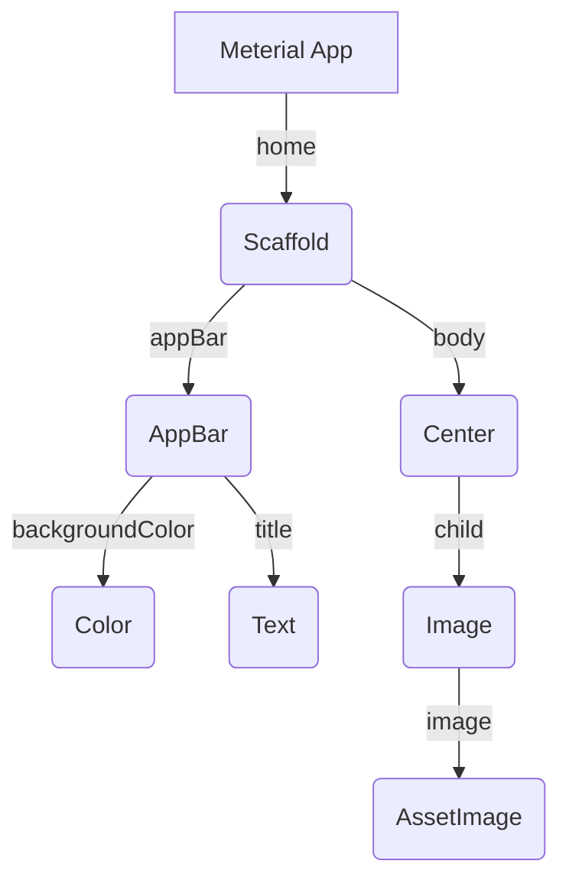

# mermaid

```mermaid

graph TD
A[Meterial App] -->|home| B(Scaffold)
B --> |appBar| C(AppBar)
C --> |backgroundColor| E(Color)
C --> |title| D(Text)
B --> |body| F(Center)
F --> |child| G(Image)
G --> |image| H(AssetImage)

```
