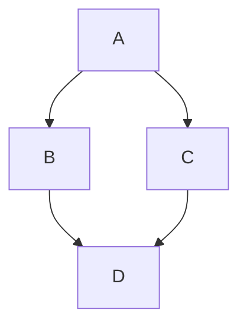
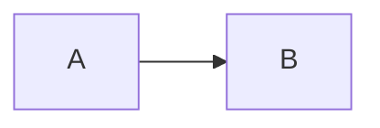
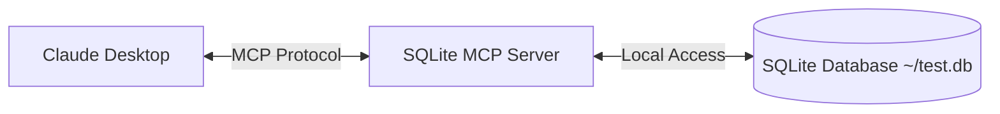
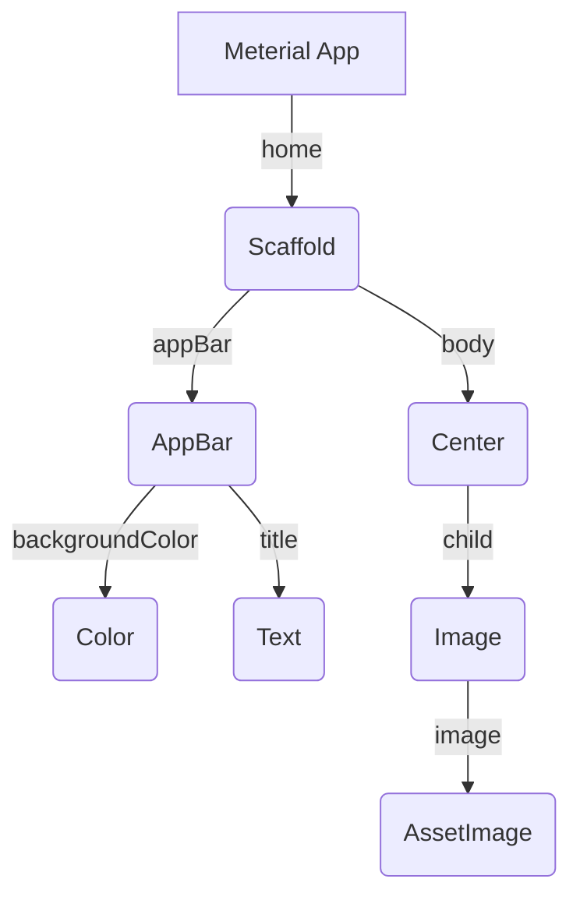

# mermaid

## cheat sheet

### basic - top-down

```mermaid
graph TD;
    A-->B;
    A-->C;
    B-->D;
    C-->D;
```

### left to right

```mermaid
graph LR;
    A-->B;
```

### with description, alias and shape(db)

```mermaid
graph LR;
    A[Claude Desktop]<-->|MCP Protocol|B[SQLite MCP Server];
    B<-->|Local Access|C[(SQLite Database ~/test.db)]
```

### flow

```mermaid

graph TD
A[Meterial App] -->|home| B(Scaffold)
B --> |appBar| C(AppBar)
C --> |backgroundColor| E(Color)
C --> |title| D(Text)
B --> |body| F(Center)
F --> |child| G(Image)
G --> |image| H(AssetImage)

```
